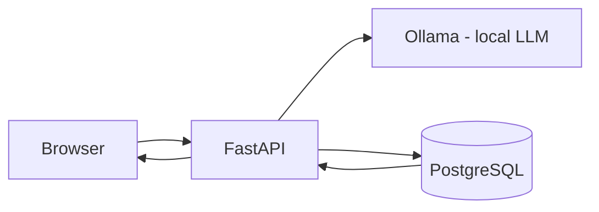

# Local LLM Question Log

A small, self-contained web app that lets you ask a local LLM a question and stores every Q&A in a database.

**Stack:** Browser → FastAPI → Ollama (local LLM) → PostgreSQL → Browser

## What it does

- Ask a question in the browser.
- FastAPI sends it to a local Ollama model (e.g. `gemma4:12b-mlx`).
- The question and the model's answer are saved to a PostgreSQL database.
- A history page shows every past interaction.

## Architecture



## Project layout

```
app/
  main.py                  # FastAPI entrypoint (routes, health check)
  database.py              # DB connection
  schemas.py               # Pydantic request/response models
  services/
    ollama_service.py      # Calls the Ollama API
    interaction_service.py # Reads/writes interactions in Postgres
  static/style.css         # Front-end styling
  templates/index.html     # Browser UI
sql/
  000_create_database.sql  # Creates the database
  001_create_interactions.sql  # Creates the interactions table
scripts/
  verify_setup.sh          # Checks the whole environment is ready
requirements.txt
.env.example               # Copy to .env and fill in
```

## Prerequisites

- **Python 3.12+** (native arm64 on Apple Silicon)
- **Ollama** running locally with a model pulled (e.g. `gemma4:12b-mlx`)
- **PostgreSQL** running locally

## Setup

```bash
# 1. Create a virtual environment and install dependencies
python3 -m venv venv
source venv/bin/activate
pip install -r requirements.txt

# 2. Configure environment
cp .env.example .env
#   - set DATABASE_URL to your Postgres connection string
#   - set OLLAMA_MODEL to the model you pulled (e.g. gemma4:12b-mlx)

# 3. Create the database and table
createdb llm_question_log
psql -d llm_question_log -f sql/001_create_interactions.sql

# 4. Verify the environment
./scripts/verify_setup.sh
```

## Run

```bash
source venv/bin/activate
uvicorn app.main:app --reload
```

Open <http://localhost:8000>.

## Endpoints

| Method | Path | Description |
|---|---|---|
| GET | `/` | Web UI |
| POST | `/ask` | Send a question, get an answer |
| GET | `/history` | List past interactions |
| GET | `/healthz` | Health check (ollama + postgres) |

## License

MIT — see [LICENSE](LICENSE).
