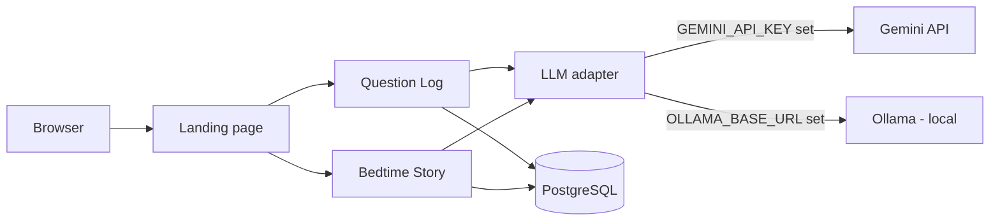

# AI Playground — LLM Question Log + Bedtime Story Generator

A single, portfolio-ready web project that runs **two apps** from one codebase:

1. **LLM Question Log** — ask a question, get an answer, and keep a history.
2. **Bedtime Story Generator** — generate a gentle bedtime story for kids.

Both apps share one PostgreSQL database and one LLM backend, and can run in two modes:

- **Local mode** — FastAPI + **Ollama** (local LLM, e.g. `gemma4:12b-mlx`) for offline development.
- **Cloud mode** — **Vercel** serverless functions + **Gemini API** for deployment.

An **LLM adapter** (`services/llm_adapter.py`) picks the backend at runtime based on environment variables, so the business logic is shared and not duplicated.

## Architecture



## Project layout

```
api/                       # Vercel serverless route handlers
  ask.py                   # POST /api/ask
  history.py               # GET  /api/history
  story.py                 # POST /api/story
  stories.py               # GET  /api/stories
  healthz.py               # GET  /api/healthz
public/                    # Static pages (plain HTML/CSS/JS)
  index.html               # Landing page with two app buttons
  question-log.html        # LLM Question Log UI
  bedtime-story.html       # Bedtime Story Generator UI
  style.css
services/                  # Shared logic
  llm_adapter.py           # Chooses Gemini or Ollama at runtime
  gemini_service.py        # Gemini API call
  database.py              # Postgres connection pool (psycopg-pool)
  interaction_service.py   # Question Log DB ops
  story_service.py         # Bedtime Story DB ops
app/                       # Local FastAPI app (Ollama) — NOT deployed
  main.py                  # Local entrypoint (uvicorn app.main:app)
  services/ollama_service.py
local/
  run_local.sh             # Helper to start the local app
sql/
  001_create_tables.sql    # Combined schema (interactions + stories)
  002_create_stories.sql   # Stories table (standalone)
scripts/
  verify_setup.sh          # Local environment checks
vercel.json                # URL rewrites for Vercel
requirements.txt
.env.example
.vercelignore              # Excludes local-only files from Vercel
```

## Prerequisites

- **Python 3.12+** (native arm64 on Apple Silicon)
- **PostgreSQL** running locally (for local mode)
- **Ollama** running locally with a model pulled (for local mode)
- **Gemini API key** (for cloud mode)

## Local mode (Ollama)

```bash
# 1. Create a virtual environment and install dependencies
python3 -m venv venv
source venv/bin/activate
pip install -r requirements.txt

# 2. Configure environment
cp .env.example .env
#   - DATABASE_URL -> your local Postgres
#   - OLLAMA_MODEL  -> e.g. gemma4:12b-mlx

# 3. Create the database and tables
createdb llm_question_log
psql -d llm_question_log -f sql/001_create_tables.sql

# 4. Verify the environment
./scripts/verify_setup.sh

# 5. Run the local app
./local/run_local.sh
# or: uvicorn app.main:app --reload
```

Open <http://localhost:8000>.

## Cloud mode (Vercel + Gemini)

1. Push this repo to GitHub.
2. In Vercel, import the repo and set the Python runtime.
3. Provision **Vercel Postgres** and run `sql/001_create_tables.sql` against it.
4. Add environment variables in Vercel (Production + Preview):
   - `GEMINI_API_KEY`
   - `GEMINI_MODEL` (e.g. `gemma-4-26b-a4b-it`)
   - `DATABASE_URL` (Vercel Postgres connection string)
5. Deploy. Vercel uses `vercel.json` rewrites and the `api/` handlers.

The `.vercelignore` excludes `app/`, `local/`, and `venv/` so only the serverless code is deployed.

## Endpoints

| Method | Path | Description |
|---|---|---|
| GET | `/` | Landing page |
| GET | `/question-log` | Question Log UI |
| GET | `/bedtime-story` | Bedtime Story UI |
| POST | `/api/ask` | Ask a question, get an answer |
| GET | `/api/history` | List recent interactions |
| POST | `/api/story` | Generate a bedtime story |
| GET | `/api/stories` | List recent stories |
| GET | `/api/healthz` | Health check (LLM + Postgres) |

## License

MIT — see [LICENSE](LICENSE).
