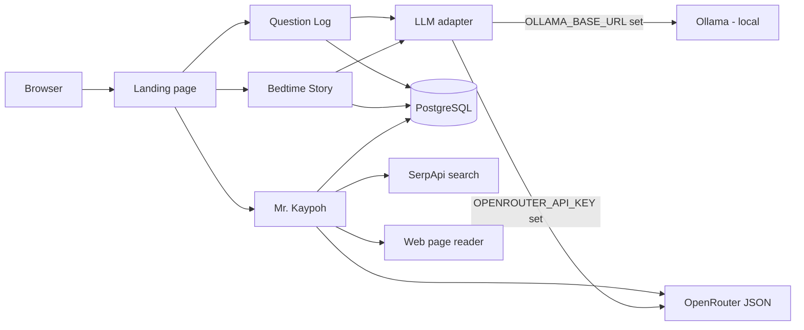

# AI Playground — Chat + Bedtime Story + Mr. Kaypoh Research Agent

A single, portfolio-ready web project that runs **three apps** from one codebase:

1. **Chat** — ask a question, get an answer, and keep a history.
2. **Bedtime Story Generator** — generate a gentle bedtime story for kids.
3. **Mr. Kaypoh — Research Agent** — an agentic AI that searches the web, reads pages, and writes a sourced research brief using a ReAct loop.

Production URL: https://ai-playground-gel.vercel.app/

Vercel creates a unique deployment URL for every push (for example, `https://ai-playground-fastapi-ollama-postgres-28ftyfl5n-gelwuyl1.vercel.app/`). Those are temporary preview URLs. The canonical public URL for this project is the aliased production domain above.

Both apps share one PostgreSQL database and one LLM backend, and can run in two modes:

- **Local mode** — FastAPI + **Ollama** (local LLM, e.g. `gemma4:e4b-mlx`) for offline development.
- **Cloud mode** — **Vercel** serverless functions + **OpenRouter API** (OpenAI-compatible) for deployment.

An **LLM adapter** (`services/llm_adapter.py`) picks the backend at runtime based on environment variables, so the business logic is shared and not duplicated.

Mr. Kaypoh uses a **client-driven ReAct loop**: the browser polls `POST /api/research_step` repeatedly, and each call executes exactly one tool action (SEARCH or READ) and persists it to Postgres. This keeps each serverless invocation short and gives the user a live trace. A 3-page gate is enforced server-side — the agent cannot FINISH until it has read at least three different web pages.

## Architecture



## Project layout

```
api/                       # Vercel serverless route handlers
  ask.py                   # POST /api/ask
  history.py               # GET  /api/history
  story.py                 # POST /api/story
  stories.py               # GET  /api/stories
  healthz.py               # GET  /api/healthz
  research_start.py        # POST /api/research_start  (Mr. Kaypoh)
  research_step.py         # POST /api/research_step   (one ReAct step)
  research_status.py       # GET  /api/research_status (session + steps)
  research_eval.py         # POST /api/research_eval   (6 checks + score)
public/                    # Static pages (plain HTML/CSS/JS)
  index.html               # Landing page with three app cards
  question-log.html        # LLM Question Log UI
  bedtime-story.html       # Bedtime Story Generator UI
  research.html            # Mr. Kaypoh Research Agent UI (live trace)
  style.css
services/                  # Shared logic
  llm_adapter.py           # Chooses OpenRouter or Ollama at runtime
  openrouter_service.py    # OpenRouter API call (call_openrouter + JSON mode)
  gemini_service.py        # Legacy Gemini SDK call (unused, kept for reference)
  database.py              # Postgres connection pool (psycopg-pool)
  interaction_service.py   # Question Log DB ops
  story_service.py         # Bedtime Story DB ops
  research_service.py      # Mr. Kaypoh tools (search_web, read_webpage, eval)
  research_engine.py       # Pure ReAct engine (run_one_step, no HTTP imports)
  fixtures.py              # Saved results for USE_FIXTURES=1 fallback
  vercel_handler.py        # Base handler for Vercel serverless functions
app/                       # Local FastAPI app (Ollama) — NOT deployed
  main.py                  # Local entrypoint (uvicorn app.main:app)
  services/ollama_service.py
local/
  run_local.sh             # Helper to start the local app
sql/
  001_create_tables.sql    # Combined schema (interactions + stories)
  002_create_stories.sql   # Stories table (standalone)
  003_research.sql         # Mr. Kaypoh tables (research_sessions + research_steps)
scripts/
  verify_setup.sh          # Local environment checks
vercel.json                # URL rewrites for Vercel
requirements.txt
.env.example
.vercelignore              # Excludes local-only files from Vercel
```

## Prerequisites

- **Python 3.12+** (native arm64 on Apple Silicon)
- **PostgreSQL** running locally (for local mode)
- **Ollama** running locally with a model pulled (for local mode)
- **OpenRouter API key** (for cloud mode)
- **SerpApi key** (for Mr. Kaypoh's SEARCH tool)

## Local mode (Ollama)

```bash
# 1. Create a virtual environment and install dependencies
python3 -m venv venv
source venv/bin/activate
pip install -r requirements.txt

# 2. Configure environment
cp .env.example .env
#   - DATABASE_URL -> your local Postgres
#   - OLLAMA_MODEL  -> e.g. gemma4:12b-mlx

# 3. Create the database and tables
createdb llm_question_log
psql -d llm_question_log -f sql/001_create_tables.sql

# 4. Verify the environment
./scripts/verify_setup.sh

# 5. Run the local app
./local/run_local.sh
# or: uvicorn app.main:app --reload
```

Open <http://localhost:8000>.

## Cloud mode (Vercel + OpenRouter)

1. Push this repo to GitHub.
2. In Vercel, import the repo and set the Python runtime.
3. Provision **Vercel Postgres** (Neon) and run the SQL migrations against it:
   - `sql/001_create_tables.sql` (interactions + stories)
   - `sql/003_research.sql` (research_sessions + research_steps)
4. Add environment variables in Vercel (Production + Preview):
   - `OPENROUTER_API_KEY` — your OpenRouter API key
   - `OPENROUTER_MODEL` — model slug (e.g. `google/gemini-2.5-flash`)
   - `DATABASE_URL` — Vercel Postgres connection string
   - `SERPAPI_KEY` — SerpApi key for Mr. Kaypoh's SEARCH tool
   - `USE_FIXTURES` — set `1` to use saved results instead of live SerpApi (optional)
5. Deploy. Vercel uses `vercel.json` rewrites and the `api/` handlers.

The `.vercelignore` excludes `app/`, `local/`, and `venv/` so only the serverless code is deployed.

## Endpoints

| Method | Path | Description |
|---|---|---|
| GET | `/` | Landing page (three app cards) |
| GET | `/question-log` | Question Log UI |
| GET | `/bedtime-story` | Bedtime Story UI |
| GET | `/research` | Mr. Kaypoh Research Agent UI (live trace) |
| POST | `/api/ask` | Ask a question, get an answer |
| GET | `/api/history` | List recent interactions |
| POST | `/api/story` | Generate a bedtime story |
| GET | `/api/stories` | List recent stories |
| POST | `/api/research_start` | Create a research session (returns session_id) |
| POST | `/api/research_step` | Execute one ReAct step (SEARCH / READ / FINISH) |
| GET | `/api/research_status` | Get session + all steps (refresh recovery) |
| POST | `/api/research_eval` | Run 6 evaluation checks on a completed session |
| GET | `/api/healthz` | Health check (OpenRouter + Postgres) |

## Mr. Kaypoh — how it works

Mr. Kaypoh is a **ReAct research agent** (Reason + Act, after Yao et al. 2022). It is not a chatbot — it runs an autonomous loop:

1. **SEARCH** the web via SerpApi for relevant sources.
2. **READ** individual web pages (httpx + BeautifulSoup, capped at 5000 chars).
3. **FINISH** by writing a research brief with sourced findings.

The loop is **client-driven**: the browser calls `POST /api/research_step` once per action, and each call:
- Loads the session + prior steps from Postgres (the agent's memory).
- Asks the model (via OpenRouter JSON mode) for the next action.
- Executes exactly one tool (search or read).
- Persists the step to `research_steps` and returns it to the browser.

**Safeguards enforced server-side (not by the model):**
- The agent cannot FINISH until it has read at least **3 different web pages**.
- Duplicate URL reads are refused.
- The step limit (10) is hard-enforced — if exceeded, the session is marked FAILED.
- Every finding must end with a source URL in brackets, or `[no source]`.
- The brief prints two separate source lists: **Pages read** and **Also found** (not opened).

**Evaluation (6 checks):**
1. Search tool used at least once.
2. More than one distinct source consulted.
3. Run stayed within the step limit.
4. Brief contains a recommendation.
5. Brief lists at least three sources.
6. No finding ends with `[no source]`.

**Fallback:** Set `USE_FIXTURES=1` to use saved SerpApi results (no quota consumed).

## License

MIT — see [LICENSE](LICENSE).
